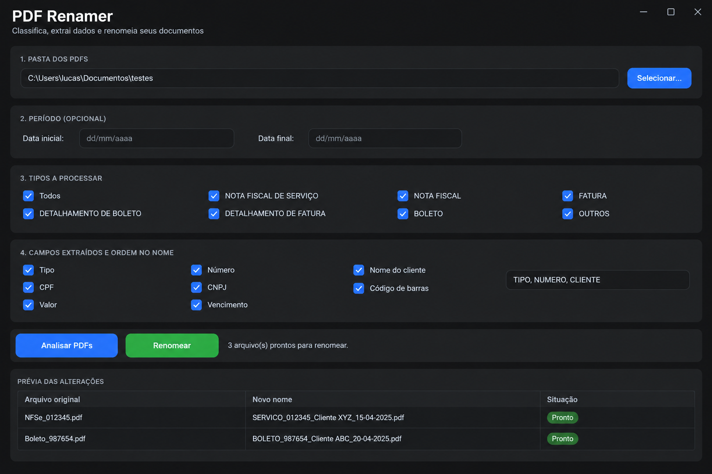
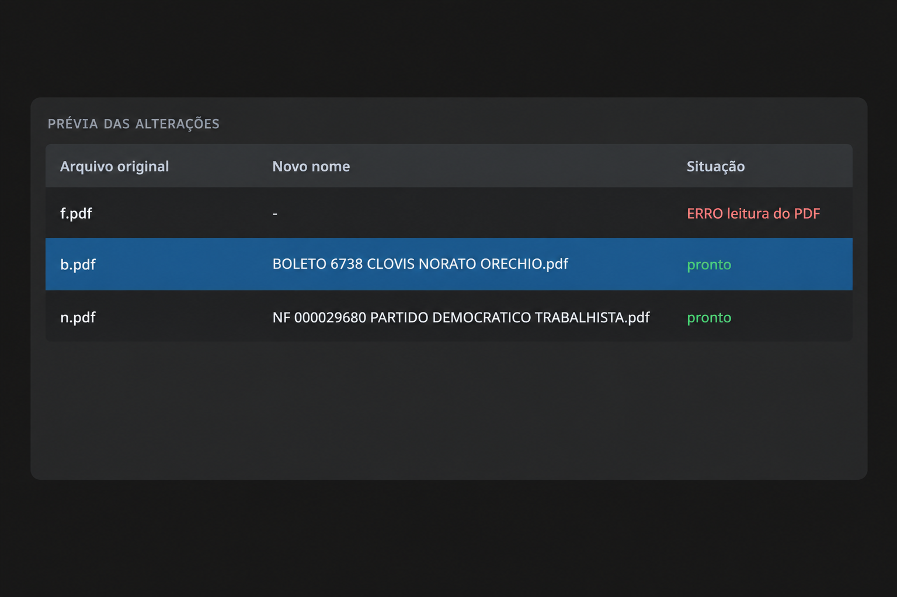

# PDF Renamer
[](https://github.com/LucasHubnerDev/pdf-renamer/actions/workflows/build.yml)

Ferramenta que lê os PDFs de uma pasta, identifica o tipo de cada documento
(boleto, fatura, nota fiscal etc.), extrai os dados relevantes e renomeia os
arquivos automaticamente, sempre com prévia e confirmação antes de qualquer
alteração.

## Capturas de tela





Funciona de três formas:

- **Interface gráfica** (`main_gui.py`): janela com tema escuro, prévia em
  tabela e barra de progresso. É a forma recomendada para o usuário final.
- **Linha de comando** (`main.py`): o mesmo fluxo em menus no terminal.
- **Executável Windows** (`PDFRenamer.exe`): gerado pelo build deste
  repositório, roda em qualquer Windows 10/11 sem instalar nada.

## Como funciona

O programa conduz um fluxo de 9 etapas:

1. Seleção da pasta com os PDFs
2. Informação do período (data inicial/final dos documentos)
3. Escolha dos tipos de documento a processar
4. Escolha dos campos a extrair e da ordem deles no nome
5. Leitura e análise dos PDFs
6. Prévia das alterações (tabela original -> novo nome)
7. Confirmação do usuário
8. Renomeação dos arquivos
9. Relatório do processamento (.txt na própria pasta)

### Pipeline de extração

```text
PDF
 └─ possui texto nativo?
     ├─ SIM  -> extração direta de texto (pypdf)
     └─ NÃO  -> páginas convertidas em imagem (300 dpi) -> OCR (Tesseract)
                └─ texto extraído
                    └─ classificação por regras de palavras-chave
                        └─ extração de campos (regex)
                            └─ filtro de tipo e período
                                └─ prévia -> confirmação -> renomear -> relatório
```

### Regras do pipeline

- **Data do filtro de período** vem do conteúdo do documento (emissão, data
  da fatura, data do documento, competência, vencimento, nessa ordem de
  prioridade), nunca da data de modificação do sistema de arquivos.
- **Faturas extraem da primeira página** (constante `TIPOS_PRIMEIRA_PAGINA`
  em `config.py`): as páginas seguintes das faturas deste layout trazem
  cópias dos DANFEs das NFC-e, com datas, nomes e valores próprios que
  poluem a extração. A classificação continua usando o texto completo.
- **Layouts colunares**: os documentos reais (fatura, DANFE, boleto) têm
  rótulo em uma linha e valores em outra. Os extratores usam a "janela do
  rótulo": resto da linha do rótulo mais a linha seguinte, priorizando
  rótulos específicos (`Valor do Documento`, `Nº do Documento`) sobre
  valores genéricos.
- **Classificação ignora acentos**: PDFs escaneados e fontes de impressora
  frequentemente perdem acentos ("Nosso Numero"); o casamento de
  palavras-chave remove acentos dos dois lados.

### Camadas do sistema

| Camada | Módulos | Responsabilidade |
|---|---|---|
| Leitura | `extraction/` | Detectar texto nativo x escaneado e extrair o texto por página |
| OCR | `extraction/ocr/` | Motor de OCR atrás de interface abstrata (troca fácil) |
| Classificação | `classification/` | Regras configuráveis em `config.py`, sem acentos |
| Campos | `fields/` | Extração de número, cliente, datas, valores etc. via regex |
| Renomeação | `renaming/` | Normalização de nomes, duplicados e execução segura |
| Interface CLI | `ui.py` | Menus, prévia e confirmação no terminal |
| Interface GUI | `main_gui.py` | Janela CustomTkinter que reaproveita todas as camadas |
| Relatório | `report.py` | Resumo no console + `.txt` para auditoria |

Garantias de segurança: nenhum arquivo é renomeado antes da confirmação;
nomes duplicados ganham sufixo `(1)`, `(2)`; um PDF com erro não interrompe
o lote; tudo roda localmente, nenhum documento sai da máquina.

## Estrutura do projeto

```text
pdf_renamer/
├── main.py                  # Orquestra as 9 etapas (CLI)
├── main_gui.py              # Interface gráfica (CustomTkinter)
├── paths.py                 # Localiza Tesseract/Poppler (código ou .exe)
├── config.py                # Regras, campos e políticas (painel de controle)
├── models.py                # Estruturas de dados compartilhadas
├── report.py                # Relatório do processamento
├── ui.py                    # Interação no terminal
├── requirements.txt         # Dependências de execução
├── requirements-dev.txt     # Dependências de desenvolvimento (pytest)
├── pytest.ini
├── build_windows.bat        # Build do .exe em máquina Windows
├── .github/workflows/build.yml   # Build do .exe no GitHub Actions
├── extraction/
│   ├── text_extractor.py    # Texto nativo (pypdf), página por página
│   ├── pdf_reader.py        # Orquestra texto direto ou rasterizar + OCR
│   └── ocr/
│       ├── base.py          # Interface abstrata do OCR
│       ├── factory.py       # Registro de motores
│       └── tesseract_engine.py
├── classification/
│   ├── rules.py             # Estrutura de uma regra
│   └── classifier.py        # Motor de pontuação por palavras-chave
├── fields/
│   └── extractors.py        # Extração de campos por regex
├── renaming/
│   ├── normalizer.py        # Sanitização de nomes de arquivo
│   └── renamer.py           # Planejar + executar renomeação
└── tests/                   # Suíte pytest com textos reais como fixtures
```

## Dependências

### Software

| Dependência | Versão | Para quê |
|---|---|---|
| Python | 3.10 ou superior | Executar o programa |
| Tesseract OCR | 5.x | Reconhecimento de texto em PDFs escaneados |
| Poppler | versão recente | Converter páginas do PDF em imagem para o OCR |
| Tk | 8.6 | Janelas da interface gráfica (vem com o Python no Windows) |

### Pacotes Python

`requirements.txt` (execução):

```text
pypdf>=4.0
pdf2image>=1.17
pytesseract>=0.3.10
Pillow>=10.0
customtkinter>=5.2
```

`requirements-dev.txt` (desenvolvimento):

```text
pytest>=8.0
```

## Instalação no Windows (passo a passo)

Compatível com Windows 10 e 11. Todos os comandos funcionam no PowerShell.

### Passo 1 — Instalar o Python

1. Baixe o instalador em https://www.python.org/downloads/
2. Execute o instalador e **marque a caixa "Add python.exe to PATH"** antes
   de clicar em "Install Now".
3. Abra um novo PowerShell e verifique:

```powershell
python --version
```

### Passo 2 — Obter o projeto

```powershell
git clone https://github.com/SEU_USUARIO/SEU_REPO.git
cd SEU_REPO
```

Sem Git: na página do repositório, botão **Code** -> **Download ZIP** ->
extraia.

### Passo 3 — Instalar o Tesseract OCR

1. Baixe o instalador para Windows em https://github.com/UB-Mannheim/tesseract/wiki
2. Durante a instalação, em "Select Components", expanda **Additional language
   data** e marque **Portuguese**.
3. Adicione `C:\Program Files\Tesseract-OCR` ao PATH (Tecla Windows ->
   "variáveis de ambiente" -> Variáveis do usuário -> `Path` -> Editar ->
   Novo).
4. **Feche e reabra o terminal** e verifique: `tesseract --version`

### Passo 4 — Instalar o Poppler

1. Baixe a build para Windows em
   https://github.com/oschwartz10612/poppler-windows/releases
   (arquivo `Release-XX.XX.X-X.zip`, não o código-fonte)
2. Extraia em `C:\poppler` e adicione ao PATH a pasta `bin` dentro de
   `Library` (ex.: `C:\poppler\poppler-26.09.0\Library\bin`)
3. Reabra o terminal e verifique: `pdftoppm -v`

### Passo 5 — Ambiente virtual e pacotes

```powershell
python -m venv .venv
.\.venv\Scripts\Activate.ps1
pip install -r requirements.txt
```

Se o PowerShell bloquear a ativação:

```powershell
Set-ExecutionPolicy -ExecutionPolicy RemoteSigned -Scope CurrentUser
```

### Passo 6 — Verificação final

```powershell
tesseract --version
pdftoppm -v
python -c "import pypdf, pdf2image, pytesseract, PIL, customtkinter; print('dependencias OK')"
```

## Instalação no Linux (desenvolvimento)

```bash
sudo apt install python3-tk tesseract-ocr tesseract-ocr-por poppler-utils
cd ~/Projects/pdf_renamer
python -m venv .venv
source .venv/bin/activate
pip install -r requirements.txt
```

Em Arch: `sudo pacman -S tk tesseract tesseract-data-por poppler`.

## Como executar

Com o ambiente virtual ativado:

```bash
python main_gui.py     # interface gráfica
python main.py         # linha de comando
```

O programa pergunta (ou recebe pelos campos da janela) a pasta, o período,
os tipos e os campos, mostra a prévia e só renomeia após confirmação:

```text
ARQUIVO ORIGINAL                        NOVO NOME
----------------------------------------   ----------------------------------------
documento001.pdf                            FATURA 139647 TRES MARIAS INDUSTRIA E COMERCIO LTDA.pdf
scan002.pdf                                 BOLETO 134386 MAYKON VON RONDOV RODRIGUES.pdf
```

Ao final, um `relatorio_AAAAMMDD_HHMMSS.txt` é gravado na própria pasta
processada. No executável, o log de erros fica em `%USERPROFILE%\PDFRenamer.log`.

## Gerar o executável Windows (.exe)

O `.exe` embute Python, pacotes, Tesseract com português e Poppler: roda em
qualquer Windows sem instalar nada (arquivo de 100 a 150 MB).

### Opção A: GitHub Actions (recomendada, não exige Windows)

1. Com o projeto no GitHub e o `.github/workflows/build.yml` commitado,
   abra a aba **Actions** do repositório.
2. Clique em **Build Windows** -> **Run workflow**.
3. Ao terminar, baixe o **PDFRenamer** na seção **Artifacts** (ZIP com o
   `PDFRenamer.exe` dentro).

### Opção B: máquina Windows

Instale Python, Tesseract e Poppler conforme os passos acima, copie o
projeto e dê dois cliques em `build_windows.bat`. O executável aparece em
`dist\PDFRenamer.exe`.

### Teste antes de distribuir

Em uma máquina sem Python e sem Tesseract: abra o `.exe`, selecione uma
pasta com um PDF escaneado e confirme que o OCR funciona. Valida de uma vez
Poppler, Tesseract e idioma embutidos.

Na primeira execução o Windows mostra o aviso do SmartScreen ("Mais
informações" -> "Executar assim mesmo"), comportamento esperado para
executáveis sem assinatura digital.

## Testes

```bash
pip install -r requirements-dev.txt
python -m pytest -v
```

A suíte cobre normalizador, classificador, extratores e renomeador, usando
como fixtures os textos reais dos documentos que o projeto já processou
(boleto Sicoob, fatura com DANFEs anexos, DANFE de NF-e). Se um ajuste
quebrar a extração, o teste falha antes de um arquivo ser renomeado errado.

## Configuração

Tudo que costuma mudar de usuário para usuário está em `config.py`:

| Opção | Padrão | Descrição |
|---|---|---|
| `OCR_ENGINE` | `"tesseract"` | Motor de OCR registrado na fábrica |
| `OCR_LANG` | `"por"` | Idioma do Tesseract |
| `OCR_DPI` | `300` | Resolução ao rasterizar páginas escaneadas |
| `MAIUSCULAS` | `True` | Nomes finais em caixa alta |
| `INCLUIR_SEM_DATA` | `True` | Mantém no fluxo PDFs sem data identificada |
| `TIPOS_PRIMEIRA_PAGINA` | `{"FATURA", ...}` | Tipos cujos campos vêm só da página 1 |
| `FIELD_CATALOG` | dicionário | Campos disponíveis no menu |
| `DEFAULT_RULES` | lista | Regras de classificação por palavras-chave |

### Adicionar um tipo de documento

Acrescente uma regra em `DEFAULT_RULES` (config.py). Regras mais específicas
vêm antes na lista. A regra BOLETO usa "nosso número" como obrigatória
porque alguns bancos (Sicoob, por exemplo) não usam a palavra "boleto" no
documento:

```python
ClassificationRule(
    tipo="CONTRATO",
    obrigatorias=("contrato",),
    opcionais=("contratante", "contratado", "cláusula"),
),
```

### Adicionar um campo

1. Escreva a função em `fields/extractors.py`;
2. Registre-a no dicionário `FIELD_EXTRACTORS`;
3. Adicione o id em `FIELD_CATALOG` (config.py).

## Solução de problemas

| Sintoma | Causa provável | Solução |
|---|---|---|
| `Unable to get page count. Is poppler installed and in PATH?` | Poppler ausente (PDF escaneado precisa dele) | Passo 4 da instalação Windows; no `.exe`, confira se o build incluiu `--add-binary` do Poppler |
| `tesseract is not installed or it's not in your PATH` | Tesseract fora do PATH | Passo 3 da instalação; no `.exe`, confira o `--add-binary` do Tesseract |
| `ImportError: libtk8.6.so` no Linux | Tk não instalado | `sudo apt install python3-tk` (ou `pacman -S tk`) |
| `'python' não é reconhecido` | Python sem PATH | Reinstale marcando "Add python.exe to PATH" |
| PowerShell bloqueia `Activate.ps1` | Política de execução | `Set-ExecutionPolicy RemoteSigned -Scope CurrentUser` |
| `cannot use geometry manager grid inside ... managed by pack` | Mistura de pack e grid no mesmo contêiner Tk | Use contêineres separados (ver `_secao` em `main_gui.py`) |
| `TypeError: expected string or bytes-like object, got 'PpmImageFile'` | `PdfContent.paginas` recebendo imagens em vez de textos | Corrigido em `pdf_reader.py` (`paginas=textos`); atualize o módulo |
| OCR ruim em documentos escaneados | Resolução baixa | Aumente `OCR_DPI` para 400 em `config.py` |
| Build do Actions falha no download do Poppler | URL de release antiga (404) | Use a release atual de `oschwartz10612/poppler-windows` no `build.yml` |

Se precisar fixar o caminho do Tesseract fora do `.exe`, adicione no início
de `extraction/ocr/tesseract_engine.py`:

```python
import pytesseract
pytesseract.pytesseract.tesseract_cmd = r"C:\Program Files\Tesseract-OCR\tesseract.exe"
```